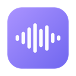
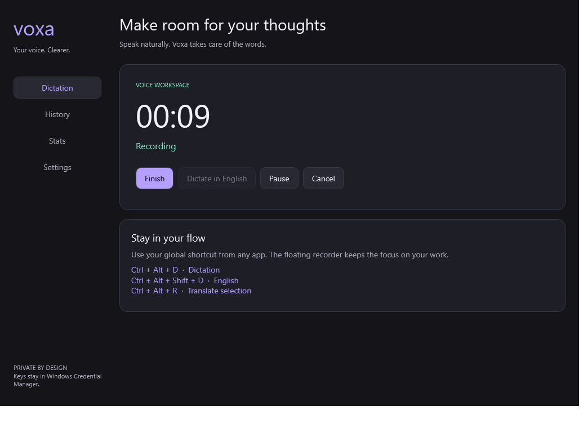

  
  <h1>Voxa</h1>
  
<strong>Speak instead of typing.</strong>

  
Dictation and translation for macOS and Windows, using your own OpenAI API key.

  

    <a href="#download">Download</a> ·
    <a href="#get-started">Get started</a> ·
    <a href="PRIVACY.md">Privacy</a> ·
    <a href="https://github.com/MichaelTarasov02/Voxa/issues">Help & feedback</a> ·
    <a href="INSTALL.ru.md">По-русски</a>
  

---

## Download

Choose your platform. You don't need a GitHub account to download Voxa.

| | macOS | Windows |
| :--- | :--- | :--- |
| **Installer** | **[Download for Mac ↓](https://github.com/MichaelTarasov02/Voxa/releases/download/v0.3.0-macos-beta.1/Voxa-0.3.0-universal.dmg)** | **[Download for Windows ↓](https://github.com/MichaelTarasov02/Voxa/releases/download/v0.2.1-windows-beta.1/Voxa-0.2.1-Windows-x64-Setup.exe)** |
| Current build | 0.3.0 beta | 0.2.1 beta |
| Requires | macOS 14 or later | Windows 11, x64 |
| Hardware | Apple Silicon and Intel | Intel / AMD; native ARM build not available |
| Package | Drag-to-install DMG | Per-user installer |

[All releases & checksums](https://github.com/MichaelTarasov02/Voxa/releases) · [Windows portable ZIP](https://github.com/MichaelTarasov02/Voxa/releases/download/v0.2.1-windows-beta.1/Voxa-0.2.1-Windows-x64-Portable.zip)

> **These are beta builds.** Mac releases are not notarized; the Windows installer is unsigned. Your computer may show a security warning. Read the installation notes below before opening the app. Only download from this repository or someone you trust.

## What you can do

**Dictate into the app you're already using.** Put the cursor in a text field, press your shortcut, and speak. Press it again to finish. Voxa transcribes the recording and can paste the result back into your app.

**Get readable text without typing the punctuation.** Cleanup helps with grammar, punctuation and speech errors. Review names, numbers and important details before sending.

**Dictate in another language, get English text.** The English mode uses a friendly, semi-formal American English style. It's useful for a message or a draft you'd otherwise have to translate yourself.

**Read selected text in Russian.** Select text in another app and use the translation shortcut. The result appears in a small bottom panel, with technical terms kept in English where appropriate. It doesn't replace your selection or paste into the message box. Escape closes it. On Mac, the ten-second timer pauses while your pointer is over the preview and restarts when you move away. Windows previews close after ten seconds.

**Translate text without recording.** Type or paste into Translation and choose a target language; American English is the default. Mac translates after a short pause and offers alternative wording. On Windows, press Translate or Ctrl + Enter.

**On Mac, revisit translations and track their cost.** History → Translations keeps results from the translator and Control + Fn. Home and Stats show translated words and estimated spending across dictation, text translation and word alternatives. Rephrasing adds its request cost without counting the same source text and target language again. Deleting text history does not erase spending totals.

**Teach the Mac dictionary your spellings.** When you correct a name or term after dictation, Voxa can suggest remembering it. Review the suggestion before saving. This depends on the editor exposing the text through Accessibility; not every app does.

**Keep a history you can return to.** Search transcripts, copy them, play saved audio, or retry a failed request. If the API fails during processing, the recording is retained for another attempt.

**Adjust it to your work.** Change shortcuts, add vocabulary for names and technical terms, choose English or Russian for the interface, and see estimated usage and cost. Both recorders have pause/resume controls.

<strong>See the Windows interface</strong>

 

Windows beta, shown with a simulated recording. The Mac app uses a separate native interface.

## Get started

### 1. Install Voxa

**Mac:** open the DMG, drag Voxa into Applications, then open it from there. If macOS blocks the first launch because the developer isn't verified, check **System Settings → Privacy & Security → Open Anyway**, but only after verifying the download source. Don't disable Gatekeeper.

**Windows:** run the setup EXE and open Voxa from the Start menu. It installs for your account without administrator rights, and you don't need to install .NET separately. If SmartScreen shows a warning, verify the source and checksum before deciding to run it. If your organization blocks unsigned apps, ask your administrator. Don't disable Defender or bypass company policy.

Prefer the portable Windows build? Extract the **entire ZIP** into a folder and run `Voxa.exe`. The EXE needs the other files in the same folder.

### 2. Add your OpenAI API key

Create a key in your [OpenAI API account](https://platform.openai.com/api-keys), then save it in Voxa's setup or Settings. Your API account needs billing and access to the models used by Voxa.

A ChatGPT Plus or Pro subscription does **not** include API usage. OpenAI bills API calls separately; Voxa's spending figures are estimates, not an invoice. Check [OpenAI's current pricing](https://openai.com/api/pricing/) and your API usage dashboard.

Never paste your key into a GitHub issue, a screenshot or a support message.

### 3. Allow access

- **Mac:** allow Microphone and Accessibility access during setup. If permission changes don't take effect, restart Voxa. For Fn dictation, check that the macOS Globe/Fn action isn't also changing your input language.
- **Windows:** in **Settings → Privacy & security → Microphone**, allow microphone access for desktop apps. Voxa uses your Windows default recording device. Open a normal, non-administrator app for your first test.

### 4. Try a short sentence

Place the cursor in a text field and use your dictation shortcut. Speak for a few seconds, finish, and check the result before trying a longer recording.

## Keyboard shortcuts

| Action | macOS defaults | Windows defaults |
| :--- | :--- | :--- |
| Start / finish dictation | **Fn** | **Ctrl + Alt + D** |
| Dictate into English | **Shift + Fn** | **Ctrl + Alt + Shift + D** |
| Translate selected text into Russian | **Control + Fn** | **Ctrl + Alt + R** |
| Cancel recording / close preview | **Escape** | **Escape** |

Shortcuts are configurable. Mac also supports fallback combinations without Fn. Windows uses standard keys because many keyboards handle Fn in hardware and don't expose it to apps.

The recording panel has cancel, finish and pause/resume controls. Closing the main Windows window keeps Voxa in the system tray. Choose **Quit** from the tray menu to exit.

## Your recordings, your key

- The key is stored in **macOS Keychain** or **Windows Credential Manager**, not in a settings file or in these downloads.
- Audio is sent to **OpenAI** for transcription. Transcripts and selected text are sent to OpenAI when you use cleanup or translation. Voxa is **not an offline transcription app**.
- History and recordings are stored on your device. The app doesn't add product analytics or telemetry.
- Local audio and history are **not encrypted by Voxa**. Protect your device and account, especially if you dictate sensitive information.

Read the [privacy details](PRIVACY.md), including storage locations, retention and removal.

## Before you rely on it

The Mac and Windows apps have different version numbers and aren't yet identical. Windows currently uses `gpt-4o-transcribe` and `gpt-4o-mini`; some Mac export, model and reporting options aren't available there. Windows recordings are limited to 10 minutes, excluding pauses.

The new translation history, automatic translation, word alternatives, dictionary learning, expanded spending totals and recent Mac interface fixes are **macOS-only**. Windows 0.2.1 adds the basic text translator, not those Mac features. Older, untracked translation costs cannot be recovered.

Automatic paste depends on the target app, its permissions and focus. Password fields, Windows apps running as administrator and some custom editors may reject it. If you change apps while a recording is processing, look in History and copy the result instead. Always review AI-generated transcription and translation; wording can be wrong.

Windows builds have automated checks for storage, API error handling, native UI, credential storage, clipboard preservation and installation. Those checks don't replace testing your microphone, keyboard and preferred apps on your own computer.

## Help us improve Voxa

[Report a problem or suggest a feature →](https://github.com/MichaelTarasov02/Voxa/issues/new/choose)

Include your OS, Voxa version, the app you were dictating into, and the steps to reproduce the issue. Please remove private text from screenshots. Don't attach API keys, personal recordings or your full history file. For a security issue, follow [SECURITY.md](SECURITY.md) instead of posting details publicly.

---

This repository hosts official downloads, documentation and issue tracking. Application source code is maintained separately and is not included here.
